Philosophy is a study of truth, love, and all the existences, especially human being. Since thousands of years ago, there are a variety of schools created by different philosophers. The philosophers used their languages to convey their thoughts, and played significant roles in history.  

By reading philosophy works, we can see the power of language, and what a slit change of words choose can do.

```{r, tidy=TRUE, echo=FALSE}
library("rvest")
library("tibble")
library("syuzhet")
library("sentimentr")
library("gplots")
library("dplyr")
library("tm")
library("syuzhet")
library("factoextra")
library("beeswarm")
library("scales")
library("RColorBrewer")
library("RANN")
library("tm")
library("topicmodels")
library("stringr")
library(RColorBrewer)
library(wordcloud)
library(SnowballC)
library(topicmodels)
philo_data <- read.csv("../data/philosophy_data.csv", 
                       stringsAsFactors = F)
```

```{r, message=FALSE}
# get 100 sample for each of the schools
# this way the database is with 1300 rows, which is the maxmum number my computer can deal with...
set.seed(5243)
data_reduced <- philo_data %>% group_by(school) %>% 
  slice_sample(n=100) %>% 
  select(school, original_publication_date, sentence_lowered)
# set up the data
sentence.list <- NULL
for(i in 1:nrow(data_reduced)){
  sentences <- syuzhet::get_sentences(
    data_reduced$sentence_lowered[i])
  if(length(sentences) > 0){
    emotions <- matrix(emotion(sentences)$emotion,
                       nrow = length(sentences),
                       byrow = T)
    colnames(emotions) <- emotion(sentences[1])$emotion_type
    emotions <- data.frame(emotions)
    emotions <- select(emotions, anticipation, joy, surprise, trust, anger, disgust, fear, sadness)
    word.count <- str_count(sentences, '\\w+')
    sentence.list <- rbind(sentence.list,
        cbind(data_reduced[i, -3], 
              sentences = as.character(sentences),
              word_count = word.count, emotions,
              sent.id = 1 : length(sentences)
              ))
  } 
}
sentence.list <- sentence.list %>% ungroup() %>%
  filter(!word_count==0)
```

```{r}
emo.means <- colMeans(select(sentence.list,
                             anticipation:sadness)>0.01)
col.use <- c("darkgoldenrod1", "darkgoldenrod1", "darkgoldenrod1",
             "darkgoldenrod1", "red2", "chartreuse3",
             "blueviolet","dodgerblue3")
barplot(emo.means[order(emo.means)], las=2,
        col=col.use[order(emo.means)], horiz=T, 
        main="Philosophy Data")
```
From the above graph, we can see that in philosophy, generally, the majority of word choice tend to be positive, represent trust, anticipation, joy. This make sense, because people love to feel good, and hence tend to read things that bring them happiness. The mainstream of philosophies were of course satisfying the needs. Some fear and sadness were also represented, but extreme negative emotion like anger or disgust takes little percentage in the whole article.  

Since 100 sample for each schools is a small number, I repeated the random process with seed 1, 2, and 3 to generate more graphics, and they all tell the same story.

With Seed 1:
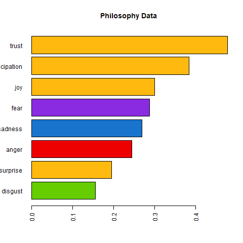
  
With Seed 2:
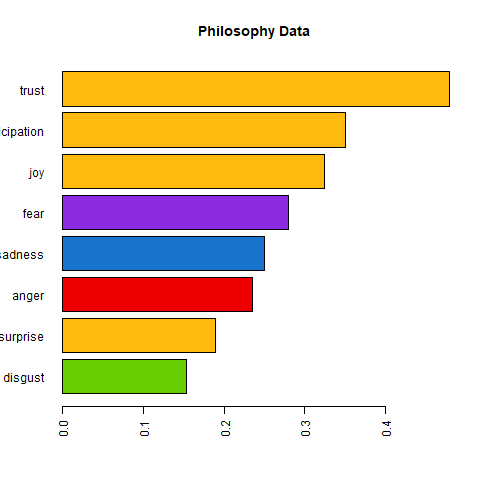
  
With Seed 2:
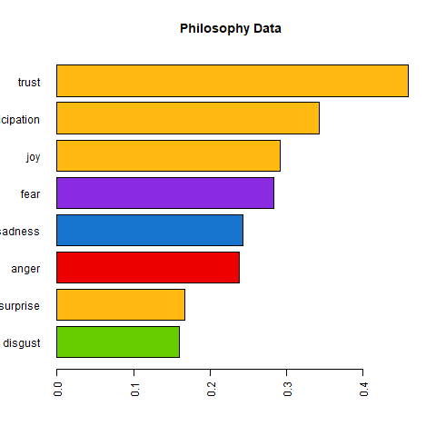
  
Also most of the words are positive, there are certain differences among schools. With wordcloud graphes, we can see clearly there are some patterns to each school. 

```{r}
wordc.fun <- function(text, name, n){
  docs <- Corpus(VectorSource(text))
  docs <- docs %>%
    tm_map(removeNumbers) %>%
    tm_map(removePunctuation) %>%
    tm_map(stripWhitespace) %>%
    tm_map(removeWords, c("the", "and", stopwords("en")))
  docs <- tm_map(docs, content_transformer(tolower))
  docs <- tm_map(docs, removeWords, stopwords("english"))
  dtm <- TermDocumentMatrix(docs)
  dtm <- removeSparseTerms(dtm, .95)
  matrix <- as.matrix(dtm) 
  words <- sort(rowSums(matrix),decreasing=TRUE) 
  df <- data.frame(word = names(words),freq=words)
  wordcloud(words = df$word, freq = df$freq, min.freq = 1,      
          max.words=n, random.order=FALSE, rot.per=0.35,        
          colors=brewer.pal(sample(1:9,1), "Dark2"))
}
```

```{r, message=FALSE, warning=FALSE}
# this time I can use a larger dataset
set.seed(5243)
data.text <- philo_data %>% group_by(school) %>% 
  slice_sample(n=1500) %>% 
  summarize(text = paste0(sentence_lowered, collapse = " ")) %>%
  ungroup()
# get the wordcloud graphs
# to better format, I attached the rest
i <- 1 # school is analytic
wordc.fun(data.text$text[i], data.text$school[i],100)
```

Philology is about human, our lives, our thoughts, and we can this clearly from the wordcould graphs of several schools. For example, the above one is from Analytic Philosophy. "One" is the most important word in all the articles, and around it, are words saying "sense", "feel", "belief", and about "truth", "fact", and "certain". 

This is not the only case "one" being the most important word in philology articles. Other examples are:

Aristotle:
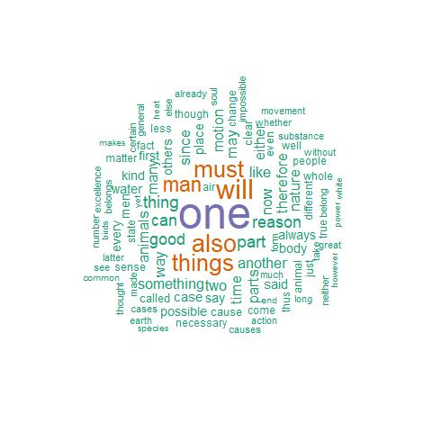
  
Plato:
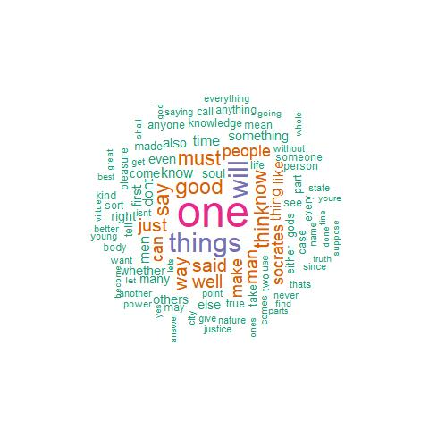

  
Continental:
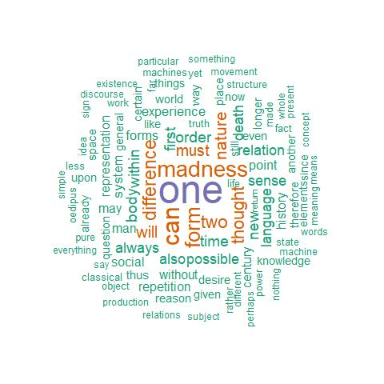
  
Empiricism:
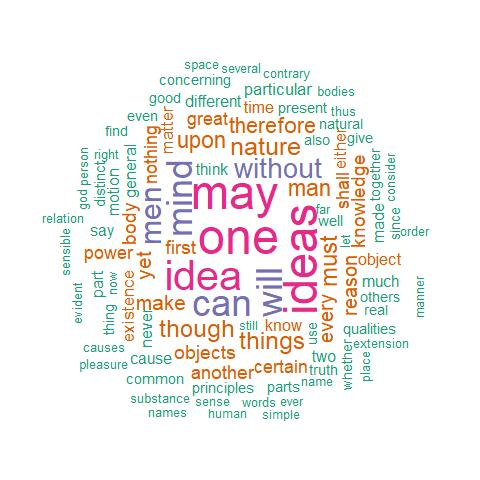
  
German Idealism:
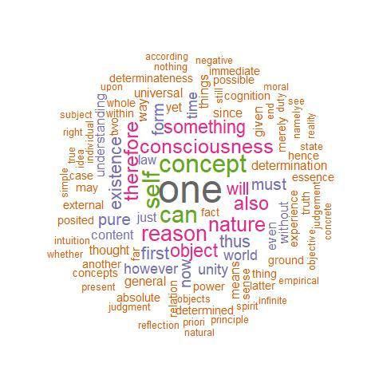
  
Nietzsche:
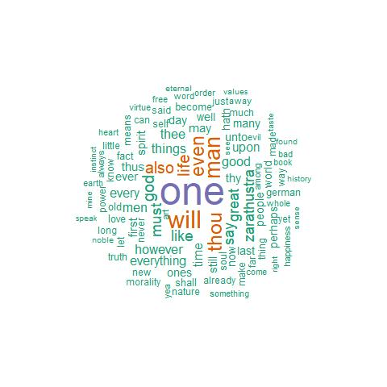
  
It is interesting to see six out of thirteen main philosophy schools are about "one", and about using word like "must", "can", "will" to tell people what to think and what to do. Even when their ideas are totally different, their have chosen the same set languages to achieve their goal.

Some of the other schools, however, are using the techneque of repeating to achieve their goals.

For example, from below pictures one can easily guess what this philosophy school is about.  

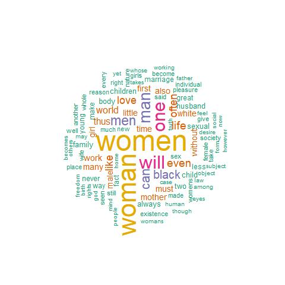
  
This is a wordcloud generated from Feminism articles, and naturally, "women" is the most important word, along with "men", "children", "mother", "life", and "marriage". Comparing these worlds with those six schools above, we can see the word choices has become more and more related to daily life. This type of language is more about convey a specific idea, other than tell people what to do. 

This type of language shift has also been seen in other philosophy schools that emerged more recently (in 200 years). Below are some examples.

Capitalism:
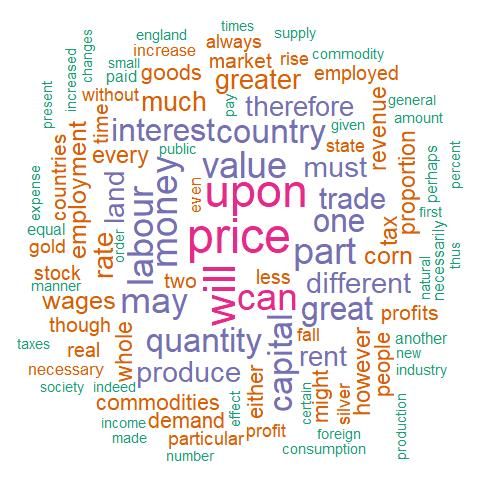

Communism:


Phenomenology:
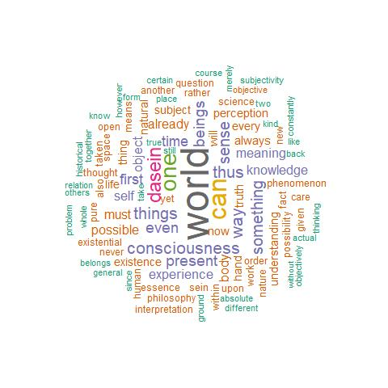

From the language choice shift of the mainstream philosophies, we can also say the needs of people are shifting. Before, people want to be told what to do, and what to believe, because at that time, we, as human, know little, and urge to know more about the world. But now, we know too many. Tweeters and news keep popping up on the phones, and we study about the world's knowledge for decades in school since we are born. Nowadays, an idea need to be repeated frequently enough to be remembered, and people choose what to believe.

It is interesting to see the languages of philosophies changed with the development of history. It is even more intriguing to think about what those changes might be in the future.

